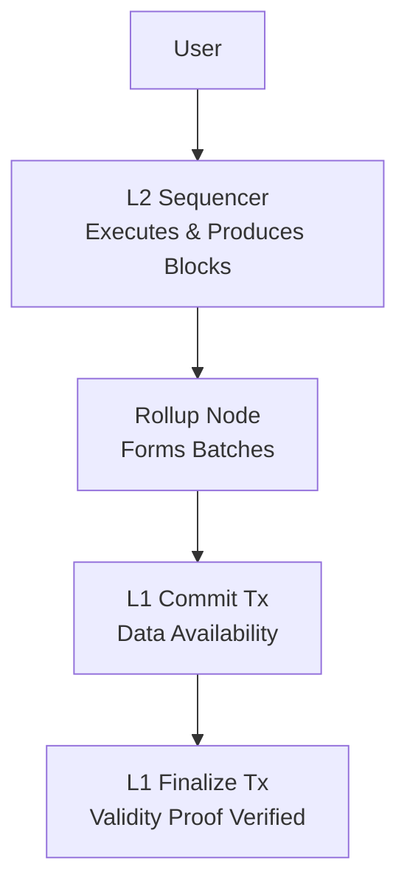

# How a Transaction Becomes Final on Scroll

## Overview

This document traces a single transaction through Scroll’s rollup pipeline — from submission to Ethereum finality.

It provides a lifecycle-first mental model for infrastructure engineers, focusing on execution, batching, data availability, and validity verification across system boundaries.

---
## Why This Document Exists

The official Scroll documentation explains execution, batching, and proving in modular sections.  

However, for new infrastructure engineers, it can be difficult to follow a single transaction linearly across system boundaries.

This document provides a lifecycle-first view of the system — focusing on how one transaction moves from submission to finality — without diving into upgrade history or prover internals.

## Architectural Scope

This document focuses strictly on the transaction lifecycle across system boundaries:

- L2 execution
- L2 batching
- L1 data availability
- L1 proof verification

It intentionally excludes upgrade mechanics, prover implementation details, and contract-level parameter definitions.

## 1. Ingress: How Transactions Enter Scroll

A transaction can enter Scroll in two ways:

- A user submits it directly to the **L2 Sequencer** through a Scroll RPC endpoint.
- A user submits it to the **L1 Bridge Contract** on Ethereum (for deposits or enforced transactions).

If submitted on L1:
- The sequencer’s **Sync Service** monitors the L1 bridge.
- It converts the L1 message into a special L2 transaction (`L1MessageTx`).

If submitted directly to L2:
- The transaction enters the sequencer’s **mempool**.

At this stage, the transaction is waiting to be executed.

---

## 2. The Sequencer Executes the Transaction

The L2 Sequencer is responsible for execution and block production.

It contains three core modules:

- **Sync Service** – pulls L1-originated messages.
- **Mempool** – stores user-submitted L2 transactions.
- **Executor** – processes transactions and builds L2 blocks.

The Executor:
- Selects transactions from both the L1 queue and L2 mempool.
- Executes them.
- Produces a new L2 block.

Once included in a block, the transaction becomes **Confirmed**.

---

## 3. Blocks Are Grouped into Chunks and Batches

Scroll reduces on-chain costs by batching transactions in multiple layers.

The Rollup Node monitors newly created L2 blocks.

The grouping structure is:

- **Block** – Basic execution unit.
- **Chunk** – A group of contiguous blocks (unit of proof generation).
- **Batch** – A group of chunks (unit of data commitment and proof verification).

When the batching criteria are met:
- The Rollup Node forms a new batch.
- The batch is prepared for commitment to Ethereum.

---

## 4. Batch Data Is Committed to Ethereum (Data Availability)

The Rollup Relayer submits a **Commit Transaction** to the L1 Rollup Contract.

This transaction:
- Posts compressed batch data to Ethereum.
- Ensures transaction data is publicly available.
- Links the batch to the previous committed batch.

After the commit transaction is finalized on L1:

The transactions inside that batch become **Committed**.

At this point, anyone can reconstruct the L2 state from L1 data.

---

## 5. Validity Proof Is Generated

Scroll uses zero-knowledge proofs to ensure correctness.

After a batch is created:

- Chunk proofs are generated by zkEVM provers.
- An Aggregator Prover combines chunk proofs into a batch proof.
- The proof is stored and prepared for submission.

This proves that all L2 transactions in the batch were executed correctly.

---

## 6. Batch Is Finalized on Ethereum

The Rollup Relayer submits a **Finalize Transaction** to the L1 Rollup Contract.

This transaction:
- Includes the validity proof.
- Includes the new L2 state root.
- Verifies the proof on Ethereum.

If verification succeeds:

The transactions in that batch become **Finalized**.

Finalized transactions are:
- Canonical
- Cryptographically verified
- Fully secured by Ethereum

---

## Lifecycle Summary

### Transaction State Transitions

| Lifecycle Stage | Trigger | Trust Assumption |
|------------|--------------------------------------------|----------------------------------|
| Confirmed  | Included in L2 block by sequencer | Trust = Sequencer ordering |
| Committed  | Batch data posted to Ethereum (L1 commit) | Trust = Data available on L1 |
| Finalized  | Validity proof verified on Ethereum | Trust = Ethereum verification |

## Why Builders Should Care

Understanding the transaction lifecycle helps you:

- Design reliable indexers
- Monitor transaction states correctly
- Handle withdrawal UX accurately
- Build infrastructure tools with correct finality assumptions

Mistaking "confirmed" for "finalized" can lead to incorrect system guarantees.

## Simplified Lifecycle Diagram

## Simplified Lifecycle Diagram

This diagram intentionally abstracts away prover internals to emphasize lifecycle boundaries between execution, data availability, and finality.        

This separation allows Scroll to:
- Provide fast execution on L2.
- Maintain Ethereum-level security.
- Reduce data and verification costs through batching.

---

## Why This Design Matters

Scroll’s architecture separates:

- Execution (L2 Sequencer)
- Data Availability (Commit on L1)
- Proof Verification (Finalize on L1)

This modular structure enables:
- Scalability through batching
- Security through validity proofs
- Clear state transitions for infrastructure systems

Understanding this lifecycle is foundational for anyone building, indexing, or operating infrastructure on Scroll.

## Comparison to Optimistic Rollups

Unlike optimistic rollups, Scroll does not rely on fraud proofs or challenge periods.

Finality is achieved through validity proofs verified on Ethereum, which removes the need for delayed withdrawal windows and dispute resolution mechanisms.
